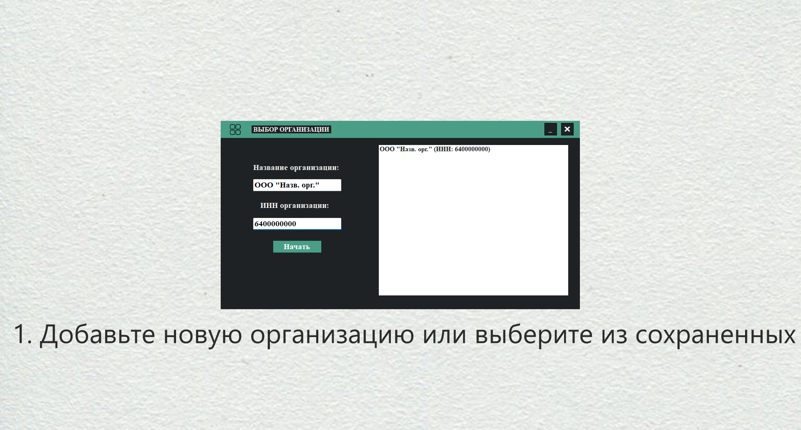
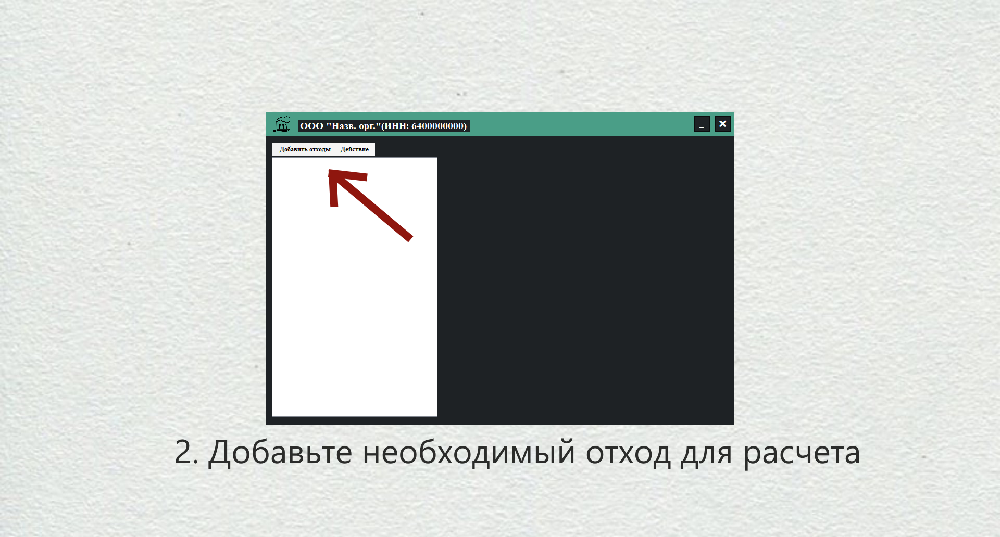
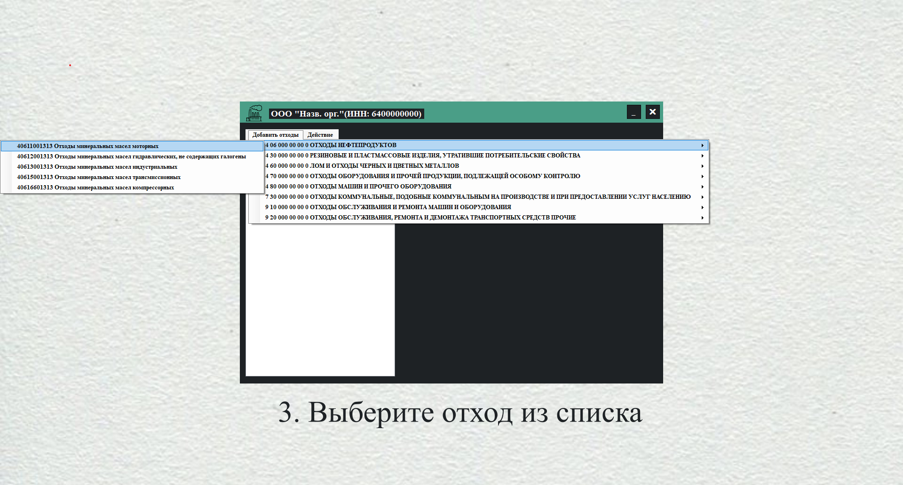
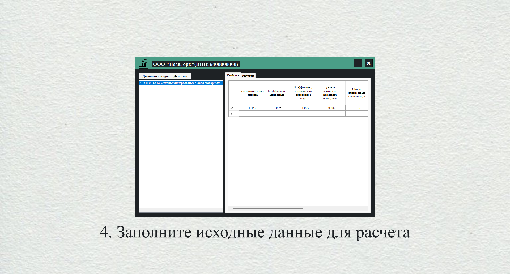
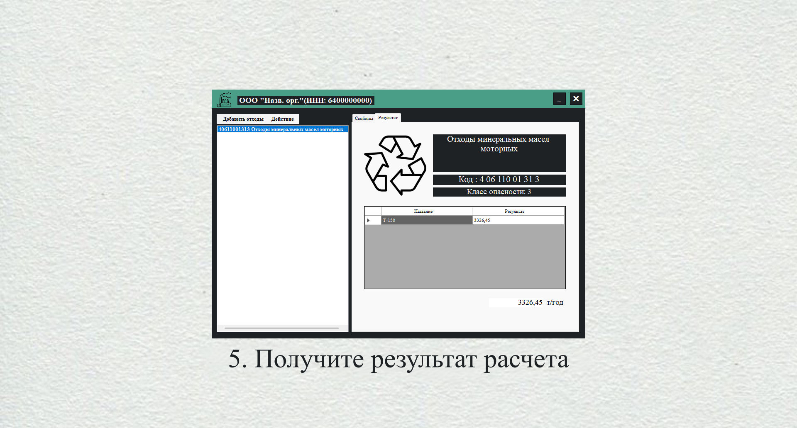
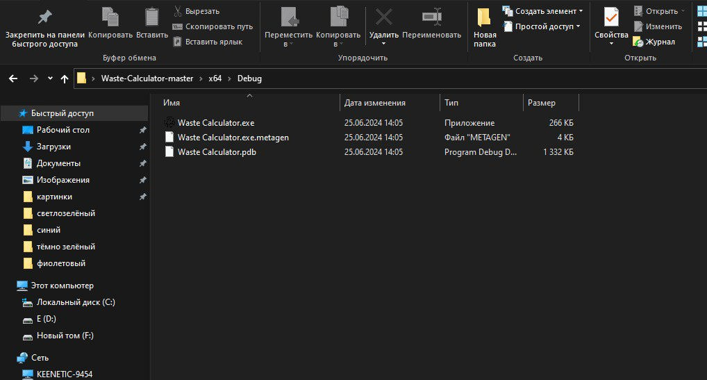
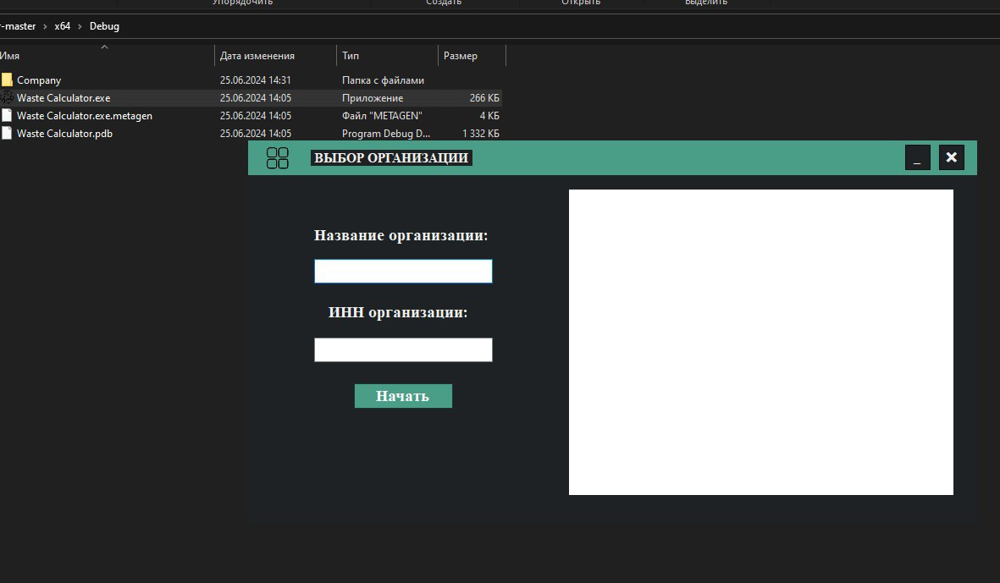

# Описание программы «Waste Calculator»

**Waste Calculator**— это удобный и простой в использовании калькулятор для расчета количества образованных отходов на предприятии. Программа предназначена для экологов, инженеров и менеджеров, занимающихся управлением отходами и экологическим мониторингом на производственных объектах.

## Основные функции программы:

1. **Добавление новой организации:**
   - Пользователь может создать новую организацию, указав необходимые данные.
   - Все введенные данные сохраняются для последующего использования.
   

2. **Загрузка сохраненной организации:**
   - Программа позволяет загружать ранее сохраненные данные организаций, что упрощает работу с постоянными клиентами или объектами.

3. **Ввод данных об отходах:**
   - В следующем окне пользователь может ввести данные об образованных отходах, включая тип отходов, их количество и другие параметры.
   - Интуитивно понятный интерфейс позволяет быстро и легко вводить все необходимые данные.

  

4. **Расчет и отображение результатов:**
   - После ввода данных программа автоматически производит расчет количества образованных отходов.
   - Результаты расчета отображаются в удобной форме, позволяя пользователю легко анализировать и использовать полученную информацию.

## Преимущества использования Waste Calculator:

- **Удобство:** Простой и интуитивно понятный интерфейс, который позволяет быстро вводить и обрабатывать данные.
- **Эффективность:** Автоматический расчет количества отходов экономит время и снижает вероятность ошибок.
- **Гибкость:** Возможность добавления новых организаций и загрузки сохраненных данных делает программу универсальной для различных предприятий.
- **Надежность:** Все данные сохраняются и могут быть использованы в любое время, что обеспечивает надежность и непрерывность работы.

## Иструкцияпо скачиванию:
 
   1. Нажмите на зеленую кнопку **Code**

   2.  В сплывающем меню выберете **Dowload ZIP**

   

   3. Разархивируйте архив на рабочем столе 

   4. Переходим по пути **x64/Debug/Waste Calculator.exe/**

   

   5. Запустите файл **Waste Calculator.exe**

   

   6. Приступайте к работе

## Стек технологий:

   **Среда разработки:** Visual Studio

   **Язык программирования:** С++

## Авторы проекта 

   ### [Maria141002](https://github.com/Maria141002)

   ### [Niah](https://github.com/Niaah)
